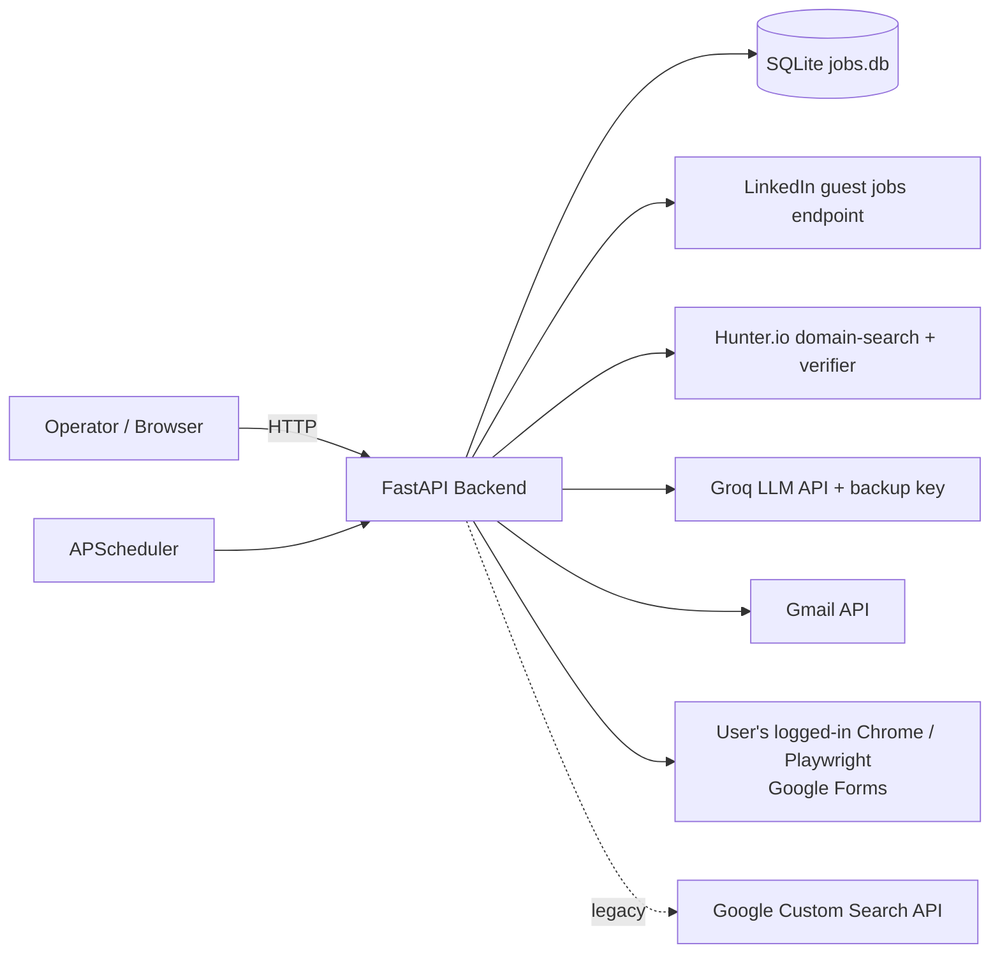
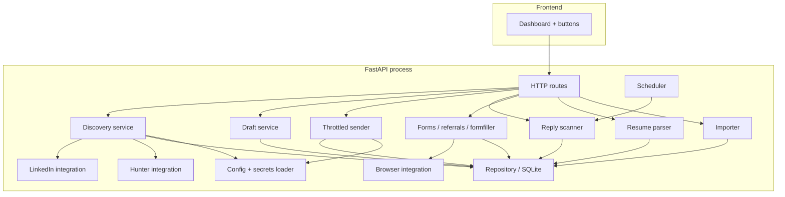
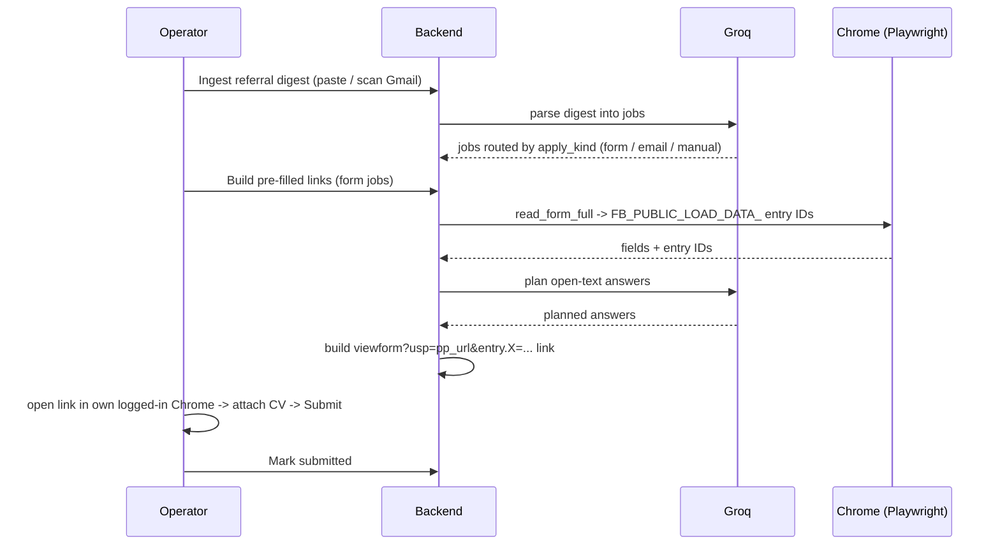
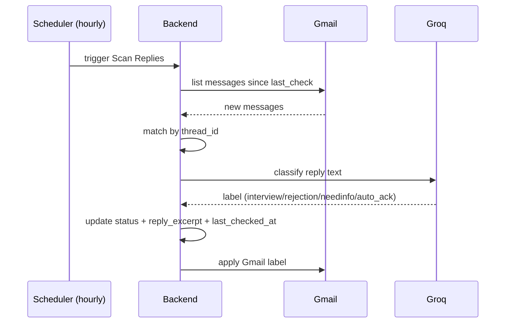

# Architecture Document
### Project: AutoApply — Free Job-Application Emailer
**Version:** 1.1 · **Status:** Final · **Last updated:** 2026-06-18

---

## 1. Architectural goals

- Single-user, **runs locally**, zero hosting cost.
- Clear pipeline of independent stages, each individually runnable and retryable.
- Safety-first sending (account protection > throughput).
- Secrets never leave the local machine.

## 2. Why not serverless (Vercel)

Rejected because: Hobby cron runs **once per day** (insufficient for hourly reply
scans), serverless functions time out at ~30–60 s (insufficient for batch scraping),
the filesystem is ephemeral (cannot persist the OAuth token or SQLite DB), and hosting
a Gmail refresh token on a public deployment is an unnecessary security risk. A local
process with an in-process scheduler solves all four cleanly and for free.

## 3. System context



Discovery now scrapes LinkedIn's public **guest** jobs endpoint (no login). The
Google Custom Search path is retained only as a disabled legacy fallback
(`discover_ats`). HR emails come from Hunter domain-search (and Hunter's verifier
guards sends); Groq runs every LLM task and auto-fails-over to a backup key on 429;
Google Forms are filled via pre-filled links opened in the operator's own Chrome.

## 4. Component view



### 4.1 Component responsibilities
- **Dashboard (frontend):** renders status tables + action buttons + quota indicators; calls backend routes.
- **HTTP routes (FastAPI):** thin controllers; validate input, invoke services, return JSON.
- **Discovery service (`services/discovery.py`):** `discover()` scrapes LinkedIn guest jobs across roles × geos, filters (interns, over-senior titles, big-company/staffing blocklist, salary < Min LPA, headcount > Max team size), stores new postings, and resolves an HR email per company via Hunter. `discover_ats` is the legacy Custom Search path (disabled).
- **LinkedIn integration (`integrations/linkedin.py`):** fetches the public guest jobs endpoint (no login) and BeautifulSoup-parses HTML cards into `{title, company, location, url, remote, salary, salary_lpa}`.
- **Hunter integration (`integrations/hunter.py`):** `find_hr_emails` runs a domain-search by company name → `{domain, headcount, contacts}` (HR/recruiter contacts first); `verify` is the pre-send mailbox check. Free tier 50/month, tracked locally.
- **Draft service:** builds a Groq prompt per posting (via `groq_client.chat`), stores draft.
- **Throttled sender (`services/sender.py`):** enforces pause/cap/ramp/warm-up gate/bounce auto-pause/verify-before-send (+ optional allow-unverified)/pre-send Hunter mailbox check/duplicate guard/first-send guard/human spacing; sends via Gmail; records thread IDs.
- **Reply scanner:** reads new mail, matches threads, classifies via Groq, updates status + labels.
- **Forms stack (`services/forms.py`, `referrals.py`, `formfiller.py`):** `referrals.parse_digest` splits a referral digest and routes each job (`form` / `email` / `manual`); `forms` orchestrates the Google-Forms flow — its primary mechanism builds **pre-filled links** (`build_prefill_links`) from a form's entry IDs; `formfiller` plans answers (Groq for open text).
- **Browser integration (`integrations/browser.py`):** persistent-context Playwright launched against the operator's **real installed Chrome**; `read_form_full` parses the `FB_PUBLIC_LOAD_DATA_` blob for entry IDs; also drives optional in-browser fill/submit.
- **Resume parser (`services/resume.py`):** pypdf reads `cv.pdf`, extracts email/phone/profile links, fills BLANK fields in `profile.json`.
- **Importer (`services/importer.py`):** bulk-imports jobs/contacts from CSV/Excel.
- **Scheduler (APScheduler):** triggers reply scanner hourly.
- **Repository (`db.py`):** all SQLite reads/writes; transactional; self-healing migrations.
- **Config/secrets loader:** reads `.env` + OAuth creds (incl. primary + backup Groq keys).

## 5. Technology choices & rationale

| Layer | Choice | Rationale |
|---|---|---|
| Backend | Python 3.11 + FastAPI + Uvicorn | Fast to build, great HTTP + async, huge ecosystem |
| Scheduler | APScheduler (in-process) | Hourly scans without external cron; free |
| DB | SQLite (file) | Zero-setup, local, persistent, sufficient for one user |
| Frontend | HTML + vanilla JS (or Vite/React) | Five buttons + a table; no heavy framework needed |
| Scraping | requests + BeautifulSoup | Parses LinkedIn guest job cards (HTML); no browser needed for discovery |
| Forms | Playwright (real installed Chrome, persistent context) | Google trusts real Chrome at sign-in; reads `FB_PUBLIC_LOAD_DATA_` entry IDs for pre-filled links + optional in-browser fill |
| Résumé | pypdf | Extracts contact details from `cv.pdf` into `profile.json` |
| LLM | Groq `llama-3.3-70b-versatile` (OpenAI-compatible) + backup key | Free tier ample, fast, drop-in OpenAI SDK; auto-fails-over to a second key on 429 |
| Discovery | LinkedIn public *guest* jobs endpoint | No login (lower ban risk); real remote openings. Google Custom Search kept only as legacy fallback |
| Contacts / Verify | Hunter.io domain-search + email-verifier | 50 free/month; domain-search finds HR emails + headcount, verifier cuts bounces pre-send |
| Mail | Gmail API (OAuth) | One API for both send and read; uses the operator's own account |

## 6. Key data flows

### 6.1 Discover → Send (happy path)
```mermaid
sequenceDiagram
    participant U as Operator
    participant API as Backend
    participant LI as LinkedIn guest
    participant HUN as Hunter
    participant GROQ as Groq
    participant GM as Gmail
    U->>API: ① Find Jobs (filters: roles × geos, remote, Min LPA, Max team size)
    loop each role × geo
        API->>LI: scrape guest job cards
        LI-->>API: postings (title/company/url/salary)
    end
    API->>API: dedupe + filter (interns, over-senior, big-co/staffing, below-salary)
    loop each kept company (Hunter budget)
        API->>HUN: domain-search by company name
        HUN-->>API: {domain, headcount, HR contacts}
        API->>API: drop if headcount > Max team size; store HR email
    end
    U->>API: ② Draft Emails
    API->>GROQ: tailor email per posting
    GROQ-->>API: draft -> applications(drafted)
    U->>API: ③ Review & Send (approve subset; may allow-unverified)
    loop each approved, throttled
        API->>API: pause/cap/ramp/warm-up, dup + first-send guards
        API->>HUN: pre-send mailbox verify (Hunter-sourced emails)
        HUN-->>API: skip if invalid, else send
        API->>GM: send (CV attached, optional Cc)
        GM-->>API: thread_id -> status sent
        API->>API: spacing 90-180s
    end
```

### 6.1a Referral digest → Google Form (pre-filled link)


### 6.2 Automated reply scan


## 7. Deployment view

Single local process started with one command (Uvicorn). SQLite file + `token.json`
persist on disk in the project directory. The browser UI is served on `localhost`.
No containers required (a Dockerfile is optional for portability).

```
127.0.0.1:8000     → FastAPI (serves API + static UI)
./jobs.db          → SQLite (self-healing migrations)
./token.json       → Gmail OAuth token (git-ignored)
./.env             → API keys incl. backup Groq key (git-ignored)
./cv.pdf           → CV: attached to emails + parsed into profile.json
./profile.json     → answers used to build pre-filled form links
./.browser_profile → Playwright persistent Chrome profile (one-time Google login)
./form_shots/      → form fill screenshots for review
```

## 8. Security architecture

- All secrets local; `.gitignore` excludes `.env`, `credentials.json`, `token.json`, `jobs.db`.
- Gmail OAuth uses a Desktop-app client in **Testing** mode with the operator as the sole test user; minimal scopes (`gmail.send`, `gmail.readonly`, `gmail.modify`).
- No inbound exposure: server bound to `127.0.0.1`.
- No third-party storage of email content or contacts.

## 9. Failure handling & resilience

- External calls wrapped with retry + exponential backoff (NFR-4).
- Each pipeline stage is idempotent on its records (safe to re-run).
- Sender persists progress per email so a crash mid-batch never double-sends (thread_id + status checked before send).
- Quota exhaustion (Hunter) and LinkedIn rate-limiting (429/403 back-off) degrade gracefully and report remaining budget; Groq 429 auto-fails-over to the backup key.

## 10. Scalability note

Designed for one user and tens of applications/day. Higher volume is intentionally
**not** supported because it conflicts with deliverability safety (NFR-2). Scaling
beyond this requires paid email infrastructure, which is explicitly out of scope.
